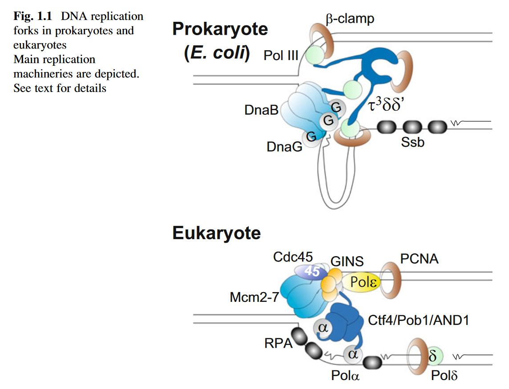
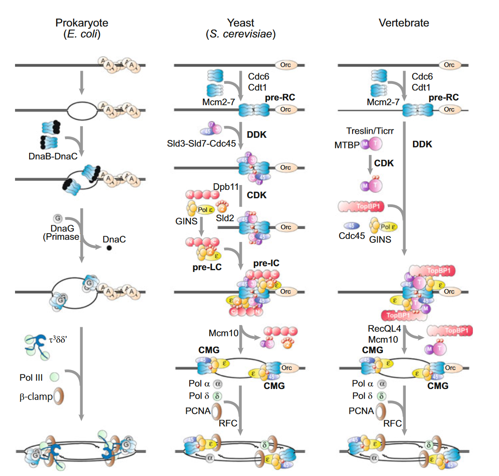

# 学习 DNA Replication_recombination_repair 的记录
## 第一部分 DNA复制
### 1. DNA 复制的分子机制
染色体DNA必须被准确地复制并平等地传递给子细胞。DNA复制的机制受到DNA聚合酶特性的限制：1.必须展开DNA双链作为模板；2.向DNA聚合酶提供3'OH末端。一旦满足这两个条件，DNA聚合酶可以在DNA任意位置开始复制。  
然而复制过程却受到严格调控，调控主要集中在复制起始区域(repliaction origins)。DNA从复制起始区域开始复制，DNA解旋酶加载到复制起点并展开DNA双链，引物酶合成RNA引物，之后由DNA聚合酶进行后续的聚合过程。  
聚合酶始终沿3'-5'方向进行延伸，因此两条链从起始位点向相反的方向进行合成，分别称为前导链和滞后链。DNA的解旋过程与两条DNA链的合成相互耦合进行，直到复制过程终止。

#### 1.1 **用于DNA复制的DNA聚合酶**
- 具有复制活性的DNA聚合酶
  - 生物体中有各种DNA聚合酶。目前在人体中发现了15种，其中DNA聚合酶$\alpha,\delta,\epsilon$ (Pol$\alpha$, Pol$\delta$, Pol$\epsilon$)参与人体染色体DNA的复制。大肠杆菌中一般只有PolIII参与DNA复制，而在其他原核生物中参与DNA复制的DNA聚合酶的种类和数量可能有所不同。
  - 用于复制的DNA聚合酶包含多个亚基，其中最大的为催化合成DNA链的亚基，而非催化的亚基则用于将催化亚基和其他复制因子联系起来。
- 通过DNA聚合酶进行DNA生物合成
  - DNA聚合酶在单链模板上从5'-3'方向延伸DNA链，这意味着，双链的DNA需要被解链形成DNA链作为模板；其次DNA聚合酶在复制叉处从相反方向进行子链的合成，其中一条子链的合成方向和复制叉运动方向相同（前导链），另一条则与之运动方向相反（滞后链）。
  - 在复制过程中，某些酶具有3'-5'的矫正活性：如果聚合过程中参入了错误的核苷酸，则利用该活性可以将错误的核苷酸酶切，重新整正确的核苷酸。但并非所有的聚合酶都具有此性质，例如Pol$\alpha$就缺乏3’-5’外切酶活性。
- 启动DNA生物合成的引物
  - DNA的合成需要核糖或脱氧核糖的3’OH。对于染色体DNA的复制，首先会由引物酶合成RNA引物。在真核细胞中，异二聚体引物酶(heterodimeric primase)与Pol$\alpha$紧密结合以合成RNA引物，随后Pol$\alpha$使用该引物合成短链DNA。在大肠杆菌中，由DnaG这种单肽引物酶合成RNA引物，随后由PolIII合成DNA链。
  - RNA引物的去除也是DNA复制的重要步骤。在真核细胞中，FEN1可以消化DNA-RNA杂合链，在RNA引物去除中发挥重要作用。1. 由Pol$\delta$剥离前一个引物，再由FEN1切断连接。切口由DNA连接酶I补齐。2. 如果剥离的DNA链很长，则具有5'-3'解旋活性和单链内切酶活性的Dna2会与单链结合蛋白RPA以及FEN1共同工作——长剥离的单链DNA与RPA结合，被Dna2内切酶活性酶切，所得到的短单链DNA再被FEN1酶切切口由DNA连接酶I补上。在大肠杆菌中，DNA聚合酶I 的5‘-3’外切酶活性和5‘-3’外切酶IX都表现出与FEN1酶切活性的相似性。由RNaseH消化DNA-RNA杂合链，由外切酶将磷酸酯键酶切，再有PolI补齐DNA链之间的间隙，最后由DNA连接酶补齐切口。
- 滑动夹子用于DNA聚合酶的渐进式合成
  - DNA聚合酶利用滑动夹子($\beta$-clamp)提高合成能力（processivity）。在大肠杆菌中，滑动夹子具有同源二聚环结构，其钳住DNA双链并与PolIII栓和。在真核细胞中，滑动夹子被称为增值细胞核抗原（PCNA）,PCNA具有同源三聚体环结构，增加了Pol$\epsilon$和Pol$\delta$的合成能力，但不增加Pol$\alpha$的合成能力。有趣的是，即使没有PCNA，Pol$\epsilon$也因为其固有的结构而具有高的合成能力。
  - 滑动夹子需要一个加载器，以将$\beta$-clamp或PCNA加载到引物DNA的3‘OH末端。 在大肠杆菌中，行使此功能的是$\tau^3\delta\delta^{'}$复合物，在真核细胞中是由真核复制因子C(RFC)与3’OH结合并加载PCNA。
  - RFC 的主要形式是由 Rfc1、Rfc2、Rfc3、Rfc4 和 Rfc5 组成的异质五聚体。另有三种替代形式，分别参与其他不同的DNA代谢机制。
  - PCNA不仅与用于复制的DNA聚合酶相互作用，还与跨损伤DNA聚合酶相互作用;该聚合酶开关由PCNA的泛素化调节。PCNA还与许多与复制（连接酶1，FEN1，Dna2），修复（Msh2-Msh3-Msh6，XPG，Ung），DNA甲基化酶（Dnmt1）和组蛋白伴侣（CAF）相关的蛋白质相互作用。这些相互作用有助于协调DNA复制和相关反应。
  - 
  
 

#### 1.2 **在复制叉处解开DNA螺旋（unwinding）**
在复制叉处，DNA解旋酶在最前方向前运动，细胞中的复制性解旋酶是一个六聚体蛋白，环围住一条单链DNA，利用ATP水解产生的能量通过空间位阻解开DNA的双螺旋。  
在大肠杆菌中，复制性解旋酶DnaB是一个同源六聚体，环围滞后链的模板DNA，并在模板连上从5‘到3’方向移动；相反，在真核细胞中，解旋酶由六个异源亚基组成，Mcm2-7，环围着前导链的模板连，在模板链上从3‘向5’方向运动。Mcm2-7具有保守的ATP结合结构域，并需要同辅助因子GINS和Cdc45形成复合物Cdc45-Mcm-GINS (CMG)，以获得强大的解螺旋活性。同时当解旋酶与加载到同一模板连的聚合酶结合时，解螺旋活性会进一步增强。  
解旋酶产生的DNA单链会被单链结合蛋白结合。原核细胞的单链结合蛋白具有同源四聚体结构；真核细胞的单链结合蛋白（复制蛋白A，RPA）具有异三聚体结构。当DNA聚合酶聚合经过该位置时，单链结合蛋白会被去除。
#### 1.3 **前置链和滞后链的合成的耦合**
- DNA聚合酶在复制叉处合成前导链和滞后链。在大肠杆菌中，DnaB解旋酶和钳夹加载器$\tau^3\delta\delta^{'}$耦合了前导链和滞后链的合成，τ亚基与PolIII的催化亚基结合，使三个DNA聚合酶拴在单个钳夹装载器上，一个用于前导链，两个用于滞后链，以促进两条链合成的耦合和滞后链的有效合成。
- 在真核细胞中，Pol$\delta$和Pol$\epsilon$分别合成滞后链和领先链。在滞后链合成过程中，Pol$/alpha$由于与引物酶紧密结合，因此经常被招募。与原核细胞不同，真核生物的钳夹加载器RFC没有参与前导链和滞后链DNA合成的耦合中。相反，GINS（活性复制解螺旋酶的一个组成部分）和Ctf4可能对耦合起作用。
- GINS是一个异源四元复合物，由Sld5、Psf1、Psf2和Psf3亚单位组成。Sld5亚基的N端在酵母中与Ctf4/ Pob1（哺乳动物细胞中的AND1）结合，AND1又与Pol$\alpha$催化亚基的N端部分结合。因此，有人提出，两个Pol$\alpha$分子通过一个GINS分子被拴在了解旋酶上。这种拴系可能促进滞后链的有效合成以及滞后链合成与解旋酶的耦合。
 

#### 1.4 **复制叉的形成**
- 将DNA解旋酶加载到复制起点
  - 复制起点由起始蛋白和起点结合蛋白指定，复制叉在复制起点形成。在大肠杆菌中，DnaA与一个**特定的DNA序列结合**，称为**DnaA盒**，DnaA与ATP结合并具有ATP酶活性，DnaA的ATP形式与DnaA盒的亲和力比DnaA的ADP形式高。在复制开始前，DnaA与位于复制起点的多个DnaA盒结合，与Fis和IHF蛋白部分解旋双链DNA，然后复制性解旋酶DnaB六聚体加载到该DNA单链上，以环围住该单链DNA。（图1.2 左）
  - 真核细胞有一个异源识别复合物（ORC; Orc1-6）与复制起点结合。一般情况下，一个ORC与一个复制起点结合，尽管复制起点总是聚集在某个特定的区域，多个ORC也只与有限的区域结合。其中Orc1，Orc4，Orc5除了结合复制起点还会与ATP结合。ORC的结构被认为类似于DnaA与起源处多个DnaA盒的结合。发芽酵母的ORC在复制原点识别一个短的特定DNA序列（ARS保守序列，约10bp），并在整个细胞周期内与之结合。在裂殖酵母中，Orc4有一个AThook区域，可与富含AT的区域结合，并可通过计算机程序进行预测。在哺乳动物中，Orc1在G2和M期会被降解或与染色质解离。此外，ORC没有结合的特异性，因此复制起源是由染色质环境而不是由DNA序列决定的。
  - 随后复制性DNA解旋酶被加载到与启动蛋白（如DnaA和ORC）相关的起点上（图1.2）。在大肠杆菌中，一个六聚体DnaB解旋酶与六个DnaC蛋白形成复合物（6个DnaB：3个DnaC的形式也被分离出来），并被DnaA加载到的解开的单链DNA上。DnaC是一个ATP结合的AAA$^{+}$蛋白，它打开六聚体DnaB的环，以包围单链DNA。DnaB的装载似乎是利用DnaB-DnaA的相互作用对前导链和滞后链模板逐一进行的。在另一些原核生物中，这一步骤需要额外的因子辅助。
  - 在真核生物中，一对Mcm2-7解旋酶核心被加载到复制起源上，形成复制前复合物（pre-RC：图1.2）。这一反应需要另外三个因子，ORC、Cdt1和Cdc6。芽孢杆菌Cdt1与Mcm2-7结合，保持环的开放。Cdc6是一种ATP结合的AAA$^{+}$蛋白，与ORC结合。ATP形式将Mcm2-7-Cdt1复合物招募到ORC结合的复制起点上。第一个Mcm2-7核心被快速招募，第二个Mcm2-7核心被缓慢招募到复制起点上。第一个Mcm2-7在复制起点形成一个瞬时的中间物，对高盐敏感。如果加载的Mcm2-7被削弱，Mcm2-7就会解离。一旦第二个Mcm2-7被成功招募，起点上的一对Mcm2-7就稳定下来。稳定装载的Mcm2-7环绕着双链DNA，对高盐有抵抗力。  
- DNA解旋酶的激活
  - 在大肠杆菌中，DnaG引物酶会增强DnaC与DnaB的解离，DnaC离去，以发挥DnaB的螺旋酶活性（图1.2），τ-PolIII进一步增强了这种螺旋酶活性。一旦DnaB螺旋酶被激活，复制叉会自动形成。
  - 在真核生物（酵母细胞）中，Sld3招募Cdc45和GINS到酵母复制原点，Cdc45和GINS与Mcm2-7紧密结合，表现出螺旋酶活性。该现象在许多复制因子的帮助下发生在复制原点，并受到细胞周期的高度调节。Cdc45-Sld3的结合在整个细胞周期中都会发生，但该复合物似乎会被细胞周期检查点的激活所破坏。该复合物在存在DDK时，可能与Pre-RC的形成起源相关。DDK是一种依赖Dbf4的蛋白激酶或Cdc7蛋白激酶，是真核生物的DNA复制所必需的。DDK会大量磷酸化Mcm2和Mcm6的N端部分，这种磷酸化可能促进对Sld3-Cdc45复合物的招募。周期依赖性激酶（CDK）对S期的开始（DNA复制的开始）是必不可少的，它在芽殖酵母中磷酸化Sld2和Sld3两种复制蛋白，以启动染色体DNA复制。磷酸化的Sld2和Sld3与另一个复制蛋白Dpb11结合，Dpb11有两对串联的Brca1 C-末端重复序列（BRCT），这是一个磷酸肽结合域。N端和C端对分别与CDK磷酸化的Sld3和Sld2结合。在CDK存在时，Sld2和Dpb11会进一步招募GINS和Polε，并形成预加载复合物（pre-loading complex, pre-LC），该复合物包括Sld2、Dpb11、GINS和Polε。由于Dpb11与CDK磷酸化的Sld3之间存在相互作用，并通过pre-LC复合物招募了GINS。
  - 从上述过程可知，两个蛋白激酶，DDK和CDK分别参与了Cdc45和GINS的招募，而Polε在复制未开始的起始阶段，实际上时、是作为一个蛋白支架在发挥作用，还没有发挥其聚合酶宫功能。整个复合物中，Sld2、Dpb11和Sld3只在起始阶段发挥作用。而GINS与位于成对的BRCT结构域之间的间隔区的相互作用对有效复制很重要，且这种相互作用在脊椎动物的GINS和TopBP1（脊椎动物中的Dpb11同源物）中是保守的。然而，尽管Cdc45和GINS与复制起始位点存在相互作用，但在没有Mcm10蛋白时，DNA双链并不会被解开。因此研究人员认为Mcm10在启动的晚期步骤中发挥了重要作用，但Mcm10的分子功能仍然未知。
- 复制叉在复制起始位点的形成
  - 复制叉的形成机制某种程度上在脊椎动物中是保守的（图1.2）。TopBP1或其蛋白家族，与Dpb11类似，有多个BRCT结构域：爪哇和人类的TopBP1s有九个BRCT结构域，横跨前四个N端BRCTs（BRCT0、BRCT1、BRCT2和BRCT3）的肽支持了DNA的复制。同时该肽与CDK磷酸化的Treslin/Ticrr结合，后者实际上是Sld3的对应物。在四个BRCTs中，BRCT1和BRCT2包含磷酸肽结合区域，而来自N端的第四个BRCT（BRCT3）对与Treslin的结合没有贡献。Treslin与Sld3中心区有同源性，该区域会与Cdc45和保守的CDK磷酸化位点结合。N端Treslin与MDM2结合蛋白（MTBP）结合，这也是DNA复制所必须的。Sld3的N端部分也与Sld7结合，而脊椎动物的RecQL4与Sld2的N端部分具有相似性，该部分在解旋酶结构域之前，是DNA复制所需要的。然而，TopBP1和RecQL4之间的相互作用并不依赖于CDK的磷酸化。Treslin与染色质结合的方式取决于pre-RC，不取决于TopBP1。TopBP1与染色质的结合取决于pre-RC，不取决于Treslin。因此，研究人员认为TopBP1和Treslin以CDK磷酸化依赖的方式在染色质上形成一个复合物，然后与染色质稳定地结合。这与CDK促进TopBP1与染色质结合的事实相一致。与Sld2不同，如果没有recQL4，尽管TopBP1、Cdc45、GINS和Polε依然会与染色质结合，但Polα和RPA则不会与染色质结合。这表明，recQL4在DNA双链解开前的复制启动晚期阶段发挥作用。
  - 

#### 1.5 DNA复制起始步骤的调节过程
- DNA复制效率主要是由DNA复制的起始步骤调控。在没有DNA损伤或shortage of precursors造成DNA复制叉停滞的情况下，一旦开始复制,复制就会持续直至结束。
- 在大肠杆菌中,DnaA和DNA复制起始区域的相互作用是可以被调控的。DnaA蛋白质含量的水平会在DNA复制起始阶段增加。在营养状况良好的培育环境下，ATP水平的提升增加了ATP-DnaA的复合物形式，并因此增强了DNA复制的启动过程。相反,一旦复制过程启动，DnaA和DNA复制起始区域的相互作用就会被抑制。被称为DnaA调节失活（RIDA）的系统调节DnaA的核苷酸形式。与DnaA同源的Hda蛋白能ADP结合，并与加载在DNA上的β-clamp形成复合物，并从DNA聚合酶中释放。这种复合物与ATP-DnaA结合，促进DnaA上ATP的水解，导致ATP-DnaA形式减少。
- DNA复制起始区域也受到SeqA蛋白的保护，该蛋白可以抑制DnaA与DNA复制起始区域的重新结合。DNA复制起始区域含有许多GATC序列，它们被Dam甲基化酶甲基化。在DNA复制过程中，GATC序列被半甲基化。SeqA蛋白与半甲基化的GATC序列结合，阻止DnaA的立即结合。
- 在真核细胞中，细胞周期会调节活性解旋酶的形成，如上所述。在细胞周期中，几种复制蛋白因为不断被转录出和降解掉，其含量水平会出现波动。此外，一些复制蛋白还会被添加上各种修饰以便进行调节。
- 在哺乳动物中，ORC与复制起始区域的相互作用是受调控的。在芽殖酵母中，ORC与复制起始区域的相互作用在整个细胞周期都存在。Pre-RC主要在G1期形成（在芽殖酵母的M期后期也有可能会形成），此时CDK的活性很低。在的G1/S交界期，CDK磷酸化Sld2和Sld3以促进DNA复制的开始。同时，CDK磷酸化ORC、Mcm2-7、Cdt1和Cdc6，CDK磷酸化后的Mcm2-7和Cdt1会被排到细胞核外，而CDK磷酸化的Cdc6则会被降解。这些蛋白在不同的生物体中受到不同机制的调节：在裂殖酵母中，Mcm2-7在整个细胞周期中都留在细胞核中，而Cdt1和Cdc6被降解；在哺乳动物中，磷酸化的Cdc6会被排到细胞核外，Cdc1被降解。
- 在一个细胞周期内，所有的起源都不会被启动（有些是休眠的），尽管所有的起源都会形成前RC。起源发射的时间调控发生在芽殖酵母中CDK依赖的复制叉形成的步骤中，因为Sld3-Sld7和Cdc45的组合（Tanaka等人，2011a）或Dpb11、Sld2、Sld3和Cdc45（Mantiero等人，2011）的剂量增加会减少时间调控；所有起源几乎在同一时间发射。在Xenopus卵子提取物中，CDK活性的增加促进了哺乳动物细胞核的起源发射（Thomson等人，2010）。这与芽胞酵母的调节是一致的（详见第二章）
- 尽管pre-RC在所有复制起始区域都有形成，但所有复制起始区域都不是在单个细胞周期(有些处于休眠状态)中被激活。在芽殖酵母中，复制起始区域的激活的时间调控发生在CDK依赖的复制叉形成阶段，因为增加Sld3-Sld7和Cdc45 或Dpb11、Sld2、Sld3和Cdc45组合的剂量会减弱时间调控；所有的复制起始区域几乎在同一时间被激活。在爪蟾卵提取物中，CDK活性的增强会促进哺乳动物细胞核内复制起始区域激活。这与芽殖酵母调控是一致的。
#### 1.6 形成复制叉的代替途径
- DNA复制一般开始于复制起始区域。但实际上，细胞生物在常规的复制起始区域之外，还存在其他的备份通路用于DNA复制。DNA聚合酶的两个特性非常重要：DNA聚合酶需要单链DNA作为模板同时需要来自引物的3’OH才能进行复制。大肠杆菌中，稳定的DNA复制机制和停滞复制叉的重新启动机制已经被研究地较为清晰——PriA和PriC将发挥于此有关的共功能。PriA会结合DNA单链，并在3’$\rightarrow$5’方向具有解旋酶活性。它会重塑滞后链的模板，使其暴露出单链DNA，以装在解旋酶，重新启动停滞的复制叉。PriB和DnaT会被PriA招募，然后它们将进一步招募DnaB，以形成新的复制叉。此外，当另一条DNA链侵入双链DNA结构，并通过重组蛋白的作用形成D-loop时，PriA-PriB-DnaT体系也会招募DnaB形成复制叉。PriA-PriB-DnaT系统更偏好具有较短DNA gap的复制叉。相反，PriC会在具有较长DNA gap的复制叉处招募DnaB。PriC会与Rep结合，Rep具有3’$\rightarrow$5’方向的解旋酶活性，并能够重塑滞后链模板，招募DnaB-DnaC。此外，在RNaseH缺失细胞中，传统的复制起始区域oriC被抑制，因此复制将从oriK开始。在oriK起点，转录和DNA聚合酶I（PolI）是启动DNA复制不可或缺的条件。因此，一个基于R-loop的模型被提出，RNA聚合酶开始转录，产生的转录本将被PolI接收，同时PriA-PriB-DnaT 将会招募DnaB解旋酶。这种起始复制的方式需要recA重组蛋白用于辅助形成R-loop，不需要其他的重组蛋白。
- 针对酵母细胞，研究人员提出了断裂诱导复制( break-induced repeat，BIR )已过程。在这个复制过程中，与大肠杆菌系统类似，重组蛋白将单链DNA转移到亲本双链DNA上，产生的D-loop用于起始。Pif1解旋酶被装载到该D-loop上，Polδ将与RFC和PCNA一起工作，使用该单链DNA作为引物进行DNA的复制起合成。BIR反应由Rad51 (在真核生物中是recA的对应物)、Pif1、Pol δ、RFC和PCNA蛋白协同行使功能完成。在人源细胞中也存在BIR过程。
- 在Haloferax volcanii古菌中，有的细胞并没有找到突出的复制起始区域。缺乏起源的细胞需要RadH，该酶在同源重组中发挥作用。因此，依赖于同源重组的DNA复制过程可能发生在这种生物体中。

#### 1.7 复制的终止过程
- 在真核细胞中，DNA复制起始于双向多个复制起始区域。当两个相反方向的复制叉相遇时，复制终止。然而，这里存在一个拓扑学的问题：在复制叉的前端，复制性解螺旋酶会解开DNA双螺旋，这会导致螺旋应力的积累（正超螺旋），该应力可以被拓扑异构酶消解。该螺旋应力在DNA复制终止区域不易消解，并会出现连环状分子，该结构最终会被拓扑异构酶II解决。
- 在大肠杆菌细胞中，复制终止区域为环状DNA上的某个预定区域，该区域会与Tus终止蛋白结合。Tus会与复制终止区域的若干位点结合，并阻止一个方向上的DNA复制。拓扑异构酶IV是一种II型拓扑异构酶，它将由复制终止形成的连环体分离开。
- 当复制叉移动至线性染色体的末端（端粒）时，滞后链上的RNA引物会被去掉，然而一般的聚合酶不能填补此处剩余的单链DNA空缺。此时端粒酶会被招募至DNA末端，合成端粒重复序列并将其添加至链的末端。

#### 1.8 DNA复制时染色体的行为
- 染色体DNA会与各种蛋白结合，其结构也会受到各种蛋白的影响。在真核细胞中，组蛋白是众所周知组成染色质结构的蛋白。但在原核生物中，也有各种与染色质相关的蛋白影响DNA的代谢。例如，为了启动DNA的复制，DNA的复制起始区域不仅会和DnaA结合，也会和Fis和IHF蛋白结合，他们协同促进了DnaA对DNA双链的解链。HU蛋白会非特异性地与DNA结合，辅助DNA在复制起点地解链。
- 真核生物具有由组蛋白八聚体组成的核小体结构。组蛋白也存在多种修饰(如乙酰化、甲基化、磷酸化等)并与其他染色质蛋白结合。在芽殖酵母中，大多数复制起始区域是不存在核小体结构的。在复制起始阶段，核小体结构影响DNA与ORC的结合。在酵母的情况下，核小体能稳定已经结合的ORC。在多细胞动物中，ORC不具有结合特异性，可能与无核小体的区域结合。
- 在DNA的复制延伸步骤中，核小体的形成是非常动态的。为了合成DNA，首先要去除核小体。DNA合成后，核小体再重新形成。对于核小体的清除，Mcm2-7发挥相关作用，Mcm2似乎行使着与核小体清除有关的功能。对于核小体的重新形成，在复制叉处形成的replisome progression复合物包含FACT复合物，它是组蛋白分子伴侣，是组蛋白重新组装到核小体所必需的。组蛋白会在特定的位点被修饰，以抑制转录或形成紧密的结构。这些修饰在复制过程中是保守的。虽然这些修饰在复制后的遗传方式尚不清晰，但许多DNA复制蛋白被认为参与了该表观遗传。
#### 1.9 展望
- 本章在分子水平上描述了染色体DNA复制的大致过程。然而，染色体DNA的协调复制以及DNA复制的调控机制还没有被清晰地阐明。真核生物的DNA复制，尤其是在多细胞生物中，还没有被很好地描述。
- 此外，DNA复制与DNA代谢相关的其他方面，如重组、修复、染色质和表观遗传学等，也还没有在分子水平上得到清晰地描述。在未来的研究中，虽然DNA复制的基本知识框架不会改变，但我们将会从更高维、更具有整体性的生物学现象或生化反应的角度来描述这一重要过程。
